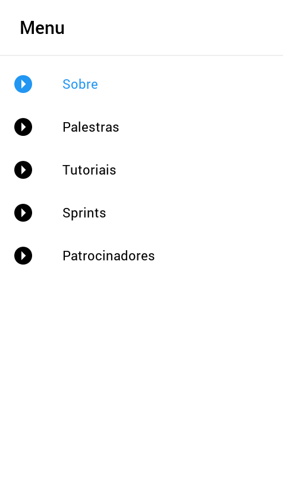
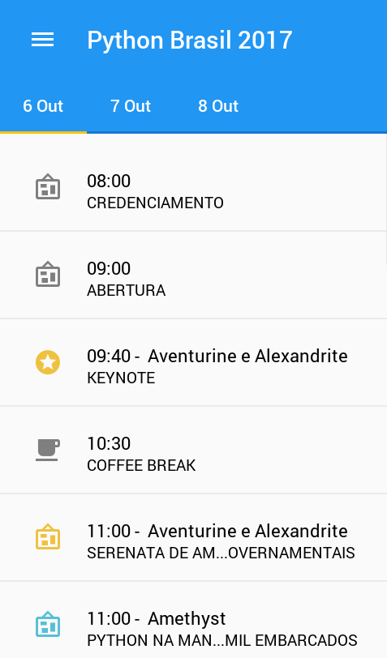

Python Brasil Kivy App
======================

Python Brasil Mobile App powered by Kivy

## Screenshots


| Initial screen  | Menu              | Schedule          |
| --------------- | ----------------- | ----------------- |
| |   |   |


## Installing and running

1. Clone repo

```
git clone https://github.com/ellisonleao/pybrapp.git
```

2. Install dependencies (use your prefered method for virtual environments)

```
$ cd pybrapp

# first install Cython 0.25.2 version
$ pip install Cython==0.25.2

# install remanining dependencies
$ pip install -r requirements.txt
```

3. Running

```
$ make run
```

## Building apk

Note: `buildozer` does not works on virtual environments so you will need to install it on your system.

1. Install Cython 0.25.2

```
$ pip install Cython==0.25.2
```

2. Install `buildozer`

```
$ pip install buildozer
```

3. Build apk

    - for debug

    ```
    $ make apk
    ```

    - for release

    ```
    $ make apk_release
    ```
